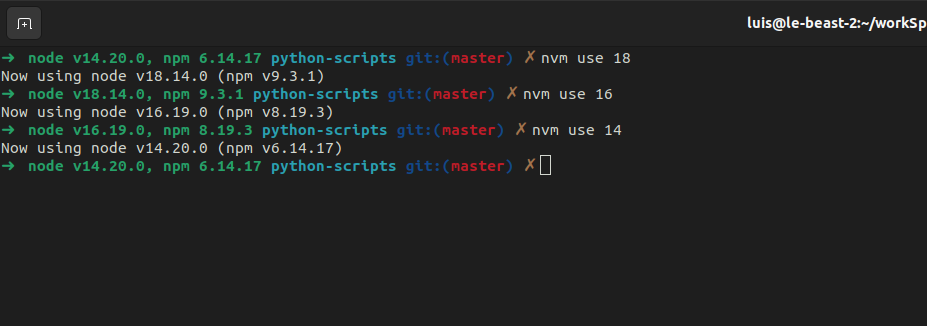

# RobbyRussel ZSH theme with node info
Adds node and npm info to the default `robbyrussell` theme for zsh. Useful when used in combination with nvm when your workflow involves switching between node versions for projects.

## How to use

### Linux with oh-my-zsh

- copy `robbyrussell-with-node-info.zsh-theme` to `~/.oh-my-zsh/themes/robbyrussell.zsh-theme`
- update `ZSH_THEME` line in `~/.zshrc` to `ZSH_THEME="robbyrussell-with-node-info"`